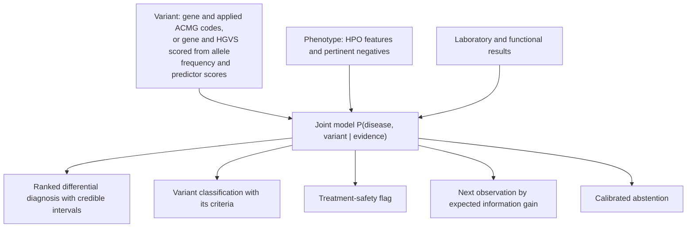

# DISCERN

Diagnostic Inference from Shared-mechanism Coupling of Evidence in Rare Nosology.

[](https://github.com/ahmedanees-m/discern/actions/workflows/ci.yml)
[](https://codecov.io/gh/ahmedanees-m/discern)
[](https://www.python.org)
[](LICENSE)
[](https://doi.org/10.5281/zenodo.21968626)

DISCERN computes a single joint posterior over disease and variant for inherited bleeding and
platelet disorders, and reports four outputs from it: a ranked differential diagnosis, an ACMG
variant classification, a management-aware treatment-safety flag, and the next observation with
the highest expected information gain.

## Overview

Inherited bleeding disorders are frequently misdiagnosed because distinct diseases converge on
the same clinical presentation through shared molecular pathways, and several of the confusable
pairs have opposed management: Glanzmann thrombasthenia against LAD-III, type 2B von Willebrand
disease against platelet-type VWD, Bernard-Soulier syndrome against immune thrombocytopenia,
factor XIII deficiency against a normal coagulation screen. On the expert-panel surface used
here, 974 of 2,239 classified variants (43.5%) are of uncertain significance.

Diagnosis and variant classification are usually built as separate pipelines. They are coupled:
the ACMG criterion PP4 ("phenotype specific for a single disease") requires a disease model,
which a variant-only classifier does not have. DISCERN models both, so the phenotype that ranks
the differential also supplies PP4, and the assay that separates two diseases supplies the
functional evidence that reclassifies the variant.

## Installation

```bash
conda env create -f environment.yml
```

Or, with pip:

```bash
pip install -e ".[dev]"
```

Requires Python 3.11 or later.

## Usage

```python
from core.dx_schemas import Feature, FeatureKind
from jointdx.factorgraph import Evidence
from jointdx.orchestrate import diagnose

evidence = Evidence(
    variant_gene="GP1BA",
    clinical=[Feature("ripa_mixing_platelet_origin", FeatureKind.LAB, True)],
)
recommendation = diagnose(evidence, planned_tx="ddavp")
print(recommendation.posterior.leading)
print(recommendation.explanation)
```

The engine accepts any subset of its inputs: a variant (a gene plus applied ACMG codes, or a
gene and HGVS description scored from allele frequency and predictor scores), clinical features
as HPO terms including explicit negatives, and laboratory or functional results.

`DxRecommendation` carries the ranked diagnosis with credible intervals, the variant
classification and the criteria behind it, any safety flags, the recommended next observation,
a templated explanation, and an audit trail.

A JSON API is available in `api/main.py` (FastAPI, `POST /diagnose`).

## Method

Evidence enters one joint model over disease and variant states:

```
P(D, V | E)  proportional to
    P(E_pheno | D) P(E_geno | V) P(E_func | D, V) P(V | G, D) P(G | D) P(D)
```

Each ACMG criterion is assigned to exactly one factor by `rules/vcep/partition.py`, so no item
of evidence is counted twice. Variant-intrinsic criteria enter the genetic factor, PP4 enters
the disease-to-variant coupling, and functional, segregation and phasing criteria enter their
own factors. Clusters are small enough that the joint is evaluated by exact enumeration.



Variant scoring follows the ClinGen VCEP specifications for ITGA2B/ITGB3, F8, F9, VWF, GP1BA
and RUNX1, including the per-code frequency thresholds, the PVS1 and PS4 strength trees, and
the per-specification REVEL and SpliceAI cut-offs.

Safety flags are adjudicated on a gene-blind posterior. Sequencing one gene does not exclude a
disease of another gene, so a treatment-divergent competitor is not retired by the sequenced
gene alone.

## Discrimination clusters

Generated from `diseases/clusters/`, so the gene lists, condition names and likelihood-ratio counts cannot drift from the model that runs.

| Cluster | Confusable conditions | Genes | Deciding observation | Consequence of confusion | LRs |
|---|---|---|---|---|---|
| C1 | Glanzmann thrombasthenia; Leukocyte adhesion deficiency type III; RASGRP2 (CalDAG-GEFI) platelet dysfunction; Leukocyte adhesion deficiency type I | `FERMT3`, `ITGA2B`, `ITGB2`, `ITGB3`, `RASGRP2` | platelet aggregometry with alphaIIbbeta3 expression and activation; leukocytosis and delayed umbilical separation | leukocyte adhesion deficiency types I and III need hematopoietic stem cell transplantation; Glanzmann thrombasthenia does not | 20 |
| C2 | Type 2B von Willebrand disease; Platelet-type von Willebrand disease; Type 2A von Willebrand disease | `GP1BA`, `VWF` | ristocetin-induced platelet aggregation (RIPA) mixing study, distinguishing plasma from platelet origin | desmopressin is contraindicated in type 2B von Willebrand disease (VWD) and can worsen thrombocytopenia | 11 |
| C3 | Bernard-Soulier syndrome; MYH9-related disorder; Immune thrombocytopenia* | `GP1BA`, `GP1BB`, `GP9`, `MYH9` | blood smear and flow cytometry for CD42 (GPIb-IX-V) | corticosteroids and splenectomy are inappropriate for an inherited macrothrombocytopenia misread as immune thrombocytopenia (ITP) | 12 |
| C4 | RUNX1 familial platelet disorder with myeloid malignancy; ETV6 thrombocytopenia with malignancy predisposition; ANKRD26-related thrombocytopenia; Immune (idiopathic) thrombocytopenia* | `ANKRD26`, `ETV6`, `RUNX1` | germline panel, pedigree, platelet size and dysmegakaryopoiesis | myeloid malignancy surveillance is required, and an affected relative must not be used as a transplant donor | 23 |
| C5 | von Willebrand disease type 2N; Mild/moderate hemophilia A | `F8`, `VWF` | von Willebrand factor to factor VIII binding assay | recombinant factor VIII monotherapy fails in type 2N VWD, which needs a VWF-containing concentrate | 10 |
| C6 | Chediak-Higashi syndrome; Hermansky-Pudlak syndrome; Gray platelet syndrome | `AP3B1`, `HPS1`, `HPS3`, `HPS4`, `HPS5`, `HPS6`, `LYST`, `NBEAL2` | electron microscopy, blood smear for giant granules, and workup for hemophagocytic lymphohistiocytosis (HLH) | Chediak-Higashi syndrome carries HLH risk and is treated by transplantation | 10 |
| C7 | Gray platelet syndrome; GFI1B-related platelet disorder; Quebec platelet disorder; ARC syndrome | `GFI1B`, `NBEAL2`, `PLAU`, `VPS33B` | blood smear, alpha-granule electron microscopy, and the urokinase overexpression assay | Quebec platelet disorder requires antifibrinolytics; platelet transfusion is ineffective and is contraindicated | 12 |
| C8 | Factor XIII deficiency; Hemophilia A; Hemophilia B | `F13A1`, `F13B`, `F8`, `F9` | individual factor activity assays, with a normal prothrombin time and activated partial thromboplastin time in factor XIII deficiency | recombinant factor XIII-A2 treats F13A1 deficiency but not F13B deficiency | 10 |
| C9 | Type 1 von Willebrand disease / low von Willebrand factor; Mild platelet function defect; no identifiable disorder | `VWF` | repeat von Willebrand factor measurement, light transmission aggregometry, and a standardized bleeding assessment score | risk of both over-treatment and under-treatment | 10 |
| C10 | Scott syndrome; a normal routine hemostatic workup | `ANO6` | platelet phosphatidylserine exposure and a prothrombinase-based assay | routine coagulation and platelet studies are normal; the diagnosis is missed without a specific assay | 10 |

Conditions marked * are acquired rather than inherited, and are included because inherited
thrombocytopenias are frequently misdiagnosed as immune thrombocytopenia. Every likelihood
ratio carries a source PMID and a sample size; a continuous integration check fails if any
entry lacks one.

## Results

Measured on public data. `docs/RESULTS.md` gives every number with the dataset and the
harness that produced it.

| Evaluation | Dataset | Result |
|---|---|---|
| ACMG combining-rule fidelity | ClinGen Evidence Repository, 2,653 bleeding-panel variants | 93.0% exact, 100% within one bin |
| Evidence partition coverage | ClinGen Evidence Repository, 12,240 variants, 170 genes | every applied criterion routed to exactly one factor |
| Bottom-line reuse inflation | same surface | 33.2% of variants band-determined by non-genetic evidence (95% CI 32.4 to 34.1) |
| Variant classification | expert-panel surface, 425 missense | AUROC 0.939 (95% CI 0.906 to 0.967) |
| Variant classification, time-split | approved after the split date, 383 missense | AUROC 0.927 (95% CI 0.882 to 0.961) |
| Calibration, out-of-fold isotonic | expert-panel surface, 425 missense | ECE 0.017 (95% CI 0.011 to 0.047) |
| Frequency threshold agreement | gnomAD frequencies cited in the expert records, 629 variants | 97.8% |
| Null-variant recall | CDC CHAMP and CHBMP, 2,130 null variants | 91.2% (F8 97.7%, F9 65.8%) |
| Intrinsic-evidence ceiling | 425 expert-classified missense variants | none reach a pathogenic band on sequence evidence alone |
| Diagnosis, curated cases | 42 published cases across 10 clusters | Top-1 100%, against a phenotype-blind gene baseline of 93% |
| Safety interlock | 5 treatment-divergence scenarios | 100% sensitivity and specificity |

Two comparisons against LIRICAL 2.4.1 on the 23 cases carrying HPO terms support different
claims and should not be combined. Restricted to the 13 findings HPO can express, with the gene
withheld from both, DISCERN reaches 74% against LIRICAL's 57% (McNemar p = 0.29), so an
advantage in reasoning on identical evidence is not established. Allowed the full 48 findings,
DISCERN reaches 91% (p = 0.02), which is significant but is a claim about what the model can
represent rather than about inference.

The curated-case Top-1 figure is in-sample: those cases were used while developing the joint
model, and the same benchmark scores 81% under the configuration that preceded the
disease-posterior correction. It characterizes the implementation and is not a held-out
comparison. The baseline that matters is the phenotype-blind gene lookup, against which the
difference is not significant (exact McNemar p = 0.25).

## Reproducing the results

Each harness writes the JSON file that the tests and the reported results read.

```bash
python -m eval.erepo_reconstruction        # ACMG fidelity and partition coverage
python -m eval.erepo_genomewide            # genome-wide partition coverage
python -m eval.champ_chbmp_benchmark       # CDC catalog recall
python -m eval.curated_case_benchmark      # curated-case diagnosis
python -m eval.gene_only_baseline          # phenotype-blind baselines
python -m eval.lirical_arm                 # external comparison
python -m bench.phase_r_variant            # variant arm, out-of-fold calibration
python -m bench.track1b_erepo_headtohead   # per-criterion agreement
python -m bench.track3_trustworthiness     # safety interlock and abstention
```

Third-party databases are not redistributed. `data/manifest.json` records each source with its
URL, version and checksum. `docs/DISCERN_Reproducibility_Checklist.md` gives the order and the
expected outputs.

## Repository layout

```
core/           shared schemas and the disease-variant data model
rules/          ACMG point engine, variant scoring, VCEP specifications, criterion partition
adapters/       evidence adapters: gnomAD, ClinVar, in-silico, splice, PVS1, MAVE, phenotype
evidence/       genetic, phenotype likelihood ratios including negatives, laboratory, functional
diseases/       disease ontology and the C1-C10 discrimination clusters
jointdx/        joint model: factor graph, inference, uncertainty, abstention, explanation
safety/         treatment-safety interlock
engine/         evidence-gap analysis, value of information, action mapping, case policy
nextobs/        next-observation ranking, partial input, what-if
equity/         ancestry reliability, evidence routing, reporting
learn/          outcome store and auditable prior updates
eval/           validation harnesses
bench/          comparative benchmarks
api/  llm/      FastAPI endpoint and model gateway
deploy/ docker/ deployment helpers and images
tests/          test suite and continuous integration guards
docs/           results, coverage architecture, dataset map, reproducibility, pre-registration
data/           source manifest with URL, version and checksum for every third-party dataset
```

Every reported number is written by a harness in `eval/` or `bench/` into a JSON file committed
alongside it, and `docs/RESULTS.md` maps each number to the harness and dataset that produced it.

## Testing

```bash
make test        # ruff and pytest
make ci          # lint and tests against tracked files only, as CI sees them
```

The suite has 242 tests. Several are regression guards rather than unit tests: they fail if a
reported value drifts from its harness output, if a likelihood ratio loses its source, if a
claim the results do not support reappears in the documentation, or if an ACMG criterion changes factor.

## Status and scope

The engine and its open-data evaluation are complete. The disease-variant coupling that
motivates the architecture is implemented and unit-tested, but it is not validated on real
paired phenotype-genotype data, because public corpora do not contain enough such cases. Its
evaluation is pre-registered with an explicit falsification condition and is not claimed until
that endpoint is reported.

Two things are deliberately not claimed. DISCERN is not the only tool that can emit a calibrated
probability: under the same folds and isotonic protocol, REVEL reaches ECE 0.043 and
AlphaMissense 0.029 against DISCERN's 0.017, with overlapping intervals, and the AUROC difference
against REVEL is not significant (DeLong p = 0.29). No monotone risk-coverage relationship is
claimed, because the diagnosis arm sits at ceiling at full coverage and this sample size leaves no
headroom to demonstrate one. `docs/RESULTS.md` states the full scope of what is and is not
claimed.

No patient-level data appears in any public artifact. The engine recommends; it does not
diagnose or treat without human sign-off.

## Citation

Mahaboob Ali AA, Delhibabu R, Nelson EJR. DISCERN: a coupled disease-variant model for
variant interpretation and differential diagnosis in inherited bleeding and platelet
disorders. 2026. doi:10.5281/zenodo.21968626

`10.5281/zenodo.21968626` is the concept DOI and always resolves to the latest archived
version. The version deposited with the paper is `10.5281/zenodo.21968627`. Machine-readable
metadata is in [CITATION.cff](CITATION.cff), and the pre-registered analysis plan for the
coupling endpoint is at <https://doi.org/10.17605/OSF.IO/5MQCV>.

## License

MIT, see [LICENSE](LICENSE). Reference datasets retain their upstream licences.

Authors: Anees Ahmed Mahaboob Ali ([@ahmedanees-m](https://github.com/ahmedanees-m)),
Radhakrishnan Delhibabu, Everette Jacob Remington Nelson.
