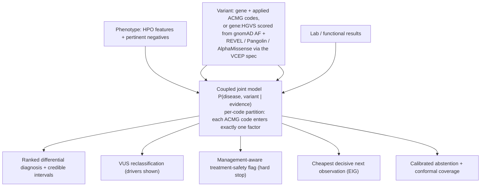

<div align="center">

# DISCERN

**Diagnostic Inference from Shared-mechanism Coupling of Evidence in Rare Nosology**

A coupled disease and variant engine for inherited bleeding and platelet disorders:
differential diagnosis, misdiagnosis prevention, and variant-of-uncertain-significance
(VUS) resolution in a single model.

[](https://github.com/ahmedanees-m/discern/actions/workflows/ci.yml)
[](https://codecov.io/gh/ahmedanees-m/discern)
[](https://www.python.org)
[](https://github.com/astral-sh/ruff)
[](LICENSE)
[](#project-status)
[](tests)

Built on a disciplined engineering foundation: a rule-grounded ACMG point engine,
swappable evidence adapters, an equity layer, full audit trails, and reproducible
infrastructure.

</div>

## Overview

Inherited bleeding disorders are frequently misdiagnosed because distinct diseases
converge on the same clinical picture through shared molecular pathways. The mistakes are
concrete and treatment changing: Glanzmann thrombasthenia versus LAD-III (which needs a
stem-cell transplant); type 2B von Willebrand disease versus platelet-type VWD (opposite
treatments, where DDAVP can harm 2B); Bernard-Soulier mistaken for ITP (leading to
needless steroids or splenectomy); Factor XIII deficiency missed until a fatal brain bleed.
More than 60 percent of variants in these genes are classified as uncertain (VUS), and the
settings that most need disambiguation have the least access to specialist labs.

DISCERN treats diagnosis, misdiagnosis safety, and VUS resolution as three readouts of one
model. It computes a single joint posterior over disease and variant, then reports the
most probable explanation, what would change it, and the cheapest observation that gets
there.

## The core idea

The criterion PP4 ("this phenotype is specific for one disease") structurally requires a
disease model. Generic variant classifiers cannot compute it properly because they do not
model the disease. DISCERN can, because the disease-discrimination model is exactly what
PP4 needs. So the disease-reasoning layer is also a VUS-resolution engine: the same
phenotype that ranks the diagnosis supplies a calibrated PP4, and the same test that
separates two diseases usually supplies the functional evidence that upgrades the variant.

## What makes it novel

| Contribution | Description |
|---|---|
| Coupled joint model | One posterior `P(D, V given E)`: phenotype informs the disease, variant-intrinsic genetics inform the variant, functional evidence informs both. PP4 is expressed as the disease-to-variant coupling, not as an added code. |
| VCEP anchored, counted once | Each ACMG code is routed to exactly one factor. The ClinGen VCEP specification is decomposed per code rather than consumed as a bottom-line label, so no evidence is double counted. A reconstruction test verifies this. |
| Management-aware safety flag | Fires on treatment danger, not on the size of the posterior gap. A small probability of a treatment-changing competitor fires (DDAVP and 2B, splenectomy and BSS, HSCT and LAD-III). |
| Cheapest decisive next observation | Ranks lab, functional, segregation, and phasing steps by information gain over the joint posterior, and works on partial inputs. |
| Calibrated abstention | Sparse likelihood ratios produce wide credible intervals, so the engine declines to call when the data cannot support it. The headline safety metric is the confident-and-wrong rate. |

## How it works



Each evidence stream enters the model exactly once (the per-code partition). The cluster is
small, so the joint is computed by exact enumeration over disease and variant states. When the
data are sparse, the engine abstains and returns the deciding observation instead.

## The discrimination clusters (the cited C1-C10 catalog)

| Cluster | Look-alike diseases | Deciding observation | Misdiagnosis harm |
|---|---|---|---|
| Integrin (C1) | Glanzmann, LAD-III, RASGRP2, LAD-I | leukocytosis, integrin activation | LAD-III and LAD-I need HSCT |
| VWF and GPIb (C2) | 2B VWD, platelet-type VWD, 2A VWD | RIPA mixing (plasma vs platelet) | DDAVP harms 2B; opposite treatment |
| Thrombocytopenia + leukaemia risk vs ITP (C4) | RUNX1, ETV6, ANKRD26 vs ITP | germline panel, pedigree, platelet size | missed leukaemia surveillance; avoid splenectomy/immunosuppression; affected relative not a donor |
| Macrothrombocytopenia vs ITP (C3) | Bernard-Soulier, MYH9 vs ITP | blood smear, CD42 flow | avoids steroids and splenectomy |
| 2N VWD vs mild hemophilia A (C5) | VWD 2N, mild/moderate hemophilia A | VWF:FVIII-binding assay | inheritance counselling; VWF-containing vs FVIII |
| Coagulation factor incl. FXIII (C8) | F8, F9, F11, F13A1/F13B, fibrinogen | factor assays, FXIII activity | recombinant FXIII-A2 works for F13A1 not F13B; FXIII miss risks brain bleed |
| Granule / storage pool (C6) | HPS, Chediak-Higashi, delta-SPD | EM, smear, HLH workup | Chediak risks HLH (HSCT) |
| Alpha-granule (C7) | Gray platelet (NBEAL2), GFI1B, ARC, Quebec | smear, EM, urokinase assay | GPS myelofibrosis surveillance; Quebec needs antifibrinolytics not platelets |
| Mild bleeding / low VWF (C9) | type-1 / low VWF, mild platelet defect, normal | repeat VWF, LTA, BAT score | over-/under-diagnosis (calibration/abstention demo) |
| Scott syndrome (C10) | Scott (ANO6) vs normal workup | PS-exposure / prothrombinase assay | easily missed (routine tests normal) |

Every likelihood ratio is linked to a source PMID and a sample size (a CI guard enforces this),
so the knowledge base is versioned and citable.

## Inputs and outputs

Input: a variant (gene plus applied ACMG codes), clinical features (HPO terms, present and
explicitly absent), and lab or functional results. Any subset is accepted (partial-input
mode).

Output (`DxRecommendation`): a ranked diagnosis with credible intervals, the measured VUS
reclassification, management-aware safety flags, the cheapest decisive next observation, a
templated explanation, and a full audit trail.

Worked examples (actual engine output):

* Glanzmann vs LAD-III, ITGB3 VUS with recurrent infections. Leading: LAD-III at 73 percent
  (95 percent CI 55 to 91). Flag: if Glanzmann instead, management changes from HSCT to
  antifibrinolytics. Cheapest next step: white cell count for leukocytosis.
* 2B vs platelet-type VWD, GP1BA with platelet-origin RIPA and planned DDAVP. Leading:
  platelet-type VWD at 84 percent. Hard stop: DDAVP is contraindicated if type 2B
  (probability 0.14); resolve first. Cheapest next step: targeted GP1BA versus VWF
  sequencing.

## Quick start

```bash
conda env create -f environment.yml        # or: pip install -e ".[dev]"
make test                                   # ruff and pytest (160 tests)
```

```python
from jointdx.factorgraph import Evidence
from jointdx.orchestrate import diagnose
from core.dx_schemas import Feature, FeatureKind

ev = Evidence(variant_gene="GP1BA",
              clinical=[Feature("ripa_mixing_platelet_origin", FeatureKind.LAB, True)])
rec = diagnose(ev, planned_tx="ddavp")
print(rec.posterior.leading, rec.explanation)   # platelet-type VWD plus a DDAVP hard stop
```

A programmatic JSON API is available (`api/main.py`, FastAPI `POST /diagnose`).

## Repository structure

```
discern/
|-- core/                          shared schemas + the DISCERN data model
|   |-- dx_schemas.py              VariantState / Feature / Disease / JointPosterior / DxRecommendation
|   `-- schemas.py  adapter.py  audit.py
|-- rules/                         ACMG point engine + novel-variant scoring
|   |-- acmg_codes.py  point_engine.py  posterior.py
|   |-- variant_scoring.py         score a novel variant: CSpec freq codes + PVS1/PS4 trees + injectable predictors
|   `-- vcep/
|       |-- loader.py  partition.py    spec loader + per-code partition (each code -> one factor)
|       `-- specs/                 ITGA2B_ITGB3, F8, F9, VWF, GP1BA, RUNX1 (.yaml, CSpec-verified thresholds)
|-- adapters/                      gnomAD, ClinVar, in-silico, splice, autoPVS1, MAVE, phenotype, prioritizer, litmine_pm3
|-- evidence/                      genetic (variant-intrinsic), phenotype_lr (+ negatives), lab/functional
|-- diseases/
|   |-- ontology.py
|   `-- clusters/                  C1-C10: integrin, vwf_gpib, macrothrombocytopenia, thr_leukemia, vwd2n_hema,
|                                  coag_factor, granule, alpha_granule, mild_vwd, scott (.yaml; every LR -> PMID)
|-- jointdx/                       THE CORE coupled joint model
|   |-- factorgraph.py  infer.py  uncertainty.py  abstain.py  orchestrate.py  explain.py
|   `-- conformal.py               Mondrian split-conformal selective prediction
|-- safety/interlock.py            management-aware misdiagnosis + treatment-safety hard-stop
|-- engine/                        gap analysis, value-of-information (voi), action_map, recommend, case_policy
|-- nextobs/                       recommend (EIG), partial-input, what-if
|-- triage/assay_priority.py       scientist-facing VUS triage
|-- intake/extract.py              free-text -> HPO + pertinent negatives
|-- equity/                        ancestry reliability, equitable routing, dashboards
|-- learn/                         outcome store + auditable prior updates
|-- eval/                          validation + benchmark harnesses
|   |-- erepo_reconstruction.py    ACMG combining fidelity + per-code partition (Tier A1)
|   |-- erepo_genomewide.py        genome-wide partition validation (H1/H2)
|   |-- clinvar_concordance.py     intrinsic-only band vs ClinVar (H3)
|   |-- erepo_thresholds.py        CSpec frequency-threshold triangulation
|   |-- gnomad_freq_check.py       per-variant gnomAD frequency cross-check
|   |-- variant_calibration.py     isotonic / Platt calibration vs ClinVar (H5)
|   |-- build_variant_set.py  lookup_alphamissense.py  fixup_multianno.py  h4_full.py    the H4 pipeline (vs InterVar)
|   |-- intervar_full_eval.py  fixup_full_multianno.py  h4_diag.py    full-database InterVar comparison (H4, 2026)
|   |-- champ_chbmp_benchmark.py   CDC F8/F9 catalog independent LOF sensitivity (91.2% null recall)
|   |-- champ_chbmp_missense_arm.py   novel-missense recall via routed PS1/PM5 + PP3 (coupling motivation)
|   |-- champ_chbmp_ps1_revel.tsv     REVEL for the 29 PS1 cases (ANNOVAR hg19_revel, VM) - reproducibility
|   |-- curated_case_benchmark.py  + cases/curated_cases.yaml     curated published-case diagnosis (B4)
|   |-- synthetic_coupling_harness.py    coupling dry-run / circularity guard (C1)
|   |-- coupling_poc.py  extract_phenopackets.py  hpo_feature_crosswalk.yaml    public coupling proof-of-concept (matched-vs-mismatched lift)
|   |-- data/                      bleeding_subset.jsonl (Phenopacket Store subset) + hpo_hist.tsv
|   |-- reader_study.py  + cases/reader_vignettes.yaml    reader-study instrument (Track 4: does-it-help; 14 citation-only vignettes)
|   `-- phenopacket_benchmark.py  vus_reclass.py  misdx_rescue.py  calibration.py
|-- api/main.py   llm/gateway.py   FastAPI /diagnose + cloud Nemotron gateway
|-- deploy/  docker/               compose.vm.yml, remote.py (SFTP), Dockerfiles (api/worker/tools)
|-- sim/  figures/  data/          simulator, figure generation, data manifest
|-- bench/                         Paper-1 positioning benchmarks: track1 (ClinVar set) + track1b (eRepo-primary + time-split) variant head-to-head vs GeneBe/REVEL/AlphaMissense; track3 trustworthiness (calibration/safety/risk-coverage); erepo_extract/erepo_to_vcf/genebe_* + cached annotations
|-- tests/                         engine, clusters, conformal, safety, coupling proof-of-concept, reader study, and CI guards (partition coverage, sourced likelihood ratios)
`-- docs/                          benchmark and validation results, claims map, dataset map, coverage architecture, reproducibility checklist, feature overview, OSF pre-registration
```

## How the validation was done (datasets in, findings out)

Every result below uses real, public data. Each box reads top to bottom: what the dataset is,
where it came from, why it is useful to DISCERN, what goes IN, and what DISCERN found that is
valuable (OUT). No patient data is used in any public result.

```
+--------------------------------------------------------------------------------+
 DATASET   ClinGen Evidence Repository (expert committee variant classifications)
 SOURCE    ClinGen, public download. 12,240 variants across 170 genes.
 WHY       Checks that DISCERN reproduces expert decisions and counts each piece
           of evidence only once (its core anti-double-counting claim).
 INPUT     A variant and the expert-applied ACMG evidence codes.
 OUTPUT    Reproduces the expert label at 93.0% exact and 100% within one bin.
           Routes every code to exactly one factor (0 unknown). A naive tool that
           reused bundled labels would over-classify 33.2% of variants; DISCERN does not.
+--------------------------------------------------------------------------------+

+--------------------------------------------------------------------------------+
 DATASET   ClinVar (community-aggregated variant classifications)
 SOURCE    NCBI ClinVar, public. 7,521 pathogenic/benign-labelled variants.
 WHY       Tests whether DISCERN's variant probabilities are well-calibrated
           (a 0.9 score should be right about 90% of the time).
 INPUT     A variant's sequence, frequency, and predictor scores.
 OUTPUT    After isotonic calibration, expected calibration error 0.008 and Brier
           score 0.0073 (from 0.201 and 0.060 uncalibrated). Calibration is the
           deliverable; the trivial-task discrimination AUC is not claimed as a result.
+--------------------------------------------------------------------------------+

+--------------------------------------------------------------------------------+
 DATASET   gnomAD population allele frequencies
 SOURCE    gnomAD, public. 629 variants with the frequency the curators cited.
 WHY       Confirms DISCERN applies the correct gene-specific rarity thresholds.
 INPUT     A variant's real gnomAD population frequency.
 OUTPUT    DISCERN's gene-specific thresholds reproduce the expert frequency code
           on 97.8% of variants.
+--------------------------------------------------------------------------------+

+--------------------------------------------------------------------------------+
 DATASET   ClinVar pathogenic/benign set vs the InterVar tool (head-to-head)
 SOURCE    1,015 labelled F8/F9/VWF/GP1BA/etc. variants; InterVar run with its
           full default database set (REVEL, gnomAD, 1000 Genomes, ClinVar, etc.).
 WHY       Tests DISCERN's gene-specific variant scoring against a standard
           automated ACMG classifier on the same variants.
 INPUT     A variant's predictors and frequency, scored by both tools.
 OUTPUT    On missense variants (the hard, decisive subset), DISCERN reaches AUC
           0.944 vs InterVar 0.811 (+0.133) and matches the best predictor REVEL
           (0.942). On all variants (dominated by easy null variants) the two are
           comparable. DISCERN's real advantage is on missense.
+--------------------------------------------------------------------------------+

+--------------------------------------------------------------------------------+
 DATASET   CDC CHAMP and CHBMP catalogs (haemophilia A/B disease variants)
 SOURCE    US CDC, public. 5,437 F8/F9 variants reported in real patients.
 WHY       An independent truth set (not from ClinGen/ClinVar) of known
           disease-causing variants, to test recall on real disease alleles.
 INPUT     A variant's predicted consequence (e.g. stop, frameshift, splice).
 OUTPUT    DISCERN classifies 91.2% of the 2,130 loss-of-function variants as
           likely-pathogenic/pathogenic from consequence alone (F8 97.7%, F9 65.8%;
           the F9 gap is fully explained by its large final exon). Missense disease
           variants stay uncertain on sequence alone, which is exactly what the
           disease-coupling layer is designed to resolve.
+--------------------------------------------------------------------------------+

+--------------------------------------------------------------------------------+
 DATASET   Curated published patient cases (diagnosis benchmark)
 SOURCE    42 real published cases across all 10 disease clusters; every citation
           (PMID) independently re-verified against NCBI.
 WHY       Tests whether DISCERN picks the correct diagnosis from the presenting
           features, including the confusable look-alike diseases.
 INPUT     A case's gene plus its presenting clinical and laboratory features.
 OUTPUT    Correct diagnosis ranked first 81% of the time and within the top three
           100% of the time, abstaining on 10%. Every non-first case is a genuine
           same-gene look-alike that is correctly kept in the top-three shortlist.
+--------------------------------------------------------------------------------+

+--------------------------------------------------------------------------------+
 DATASET   Cluster discrimination likelihood ratios (source audit)
 SOURCE    The ~95 per-feature frequency values in the disease clusters, each
           cross-checked against its cited paper.
 WHY       Confirms the diagnosis framework's numbers are grounded in the
           literature, not invented.
 INPUT     Each frequency value and the paper it cites.
 OUTPUT    All ~95 values are supported by the literature; 10 citations that
           pointed to the wrong paper were found and corrected with verified sources.
+--------------------------------------------------------------------------------+

+--------------------------------------------------------------------------------+
 DATASET   Coupling proof-of-concept (the novel core), public precursor
 SOURCE    GA4GH Phenopacket Store bleeding cases (public, PHI-free). Endpoint
           pre-registered before the run.
 WHY       First real-data, circularity-safe test of whether the disease coupling
           resolves VUS, and ONLY when phenotype and gene agree (matched vs mismatched).
 INPUT     A VUS-by-sequence variant plus the patient's clinical phenotype.
 OUTPUT    Public working set is only 2 cases, so the binary endpoint is unpowered;
           the coupling signal is directionally correct (matched 0.208 vs mismatched
           0.082). Finding: the public corpus is too thin, which is exactly
           why the confirmatory test needs the controlled-access cohort. Instrument
           built, tested, and pre-registered, ready to run when cohort access clears.
+--------------------------------------------------------------------------------+

+--------------------------------------------------------------------------------+
 DATASET   Reader-study vignette bank (Track 4: does it help a non-specialist?)
 SOURCE    14 citation-only vignettes built verbatim from the NCBI-verified curated
           cases (PHI-free): 6 treatment-divergent safety pairs, 7 deciding-test,
           1 acquired-mimic distractor.
 WHY       The operational test of usefulness; pre-registerable, no cohort access
           needed. Carries the headline safety endpoint (avoid the harmful tx).
 INPUT     A clinical vignette (and, in the aided arm, the DISCERN card: ranked
           diagnosis, recommended deciding test, management hard-stop).
 OUTPUT    DISCERN-side ceiling on the bank: disease 85% (11/13), harmful-management
           flagged 100% (6/6), correct deciding test 62%; the gene-less acquired
           mimic is correctly not routed. Randomized with-vs-without reader arms are
           the user-run step after the OSF lock.
+--------------------------------------------------------------------------------+
```

## Validation status

Real-data results (Tier A, open data; see `docs/DISCERN_Validation_Results.md`):

* ACMG combining-rule fidelity on the real ClinGen Evidence Repository: on 2,653 real
  VCEP-classified bleeding-gene variants, the Tavtigian point engine reproduces the VCEP's
  bottom-line label from the experts' own applied codes at 93.0 percent exact and 100
  percent within-one-bin. This validates the point values and banding, not code assignment
  (the codes are given) and not the disease-variant coupling (no phenotype is present here).
* Per-code partition on the same variants (the no-double-counting evidence): every applied
  code is routed to exactly one factor (0 unknown); codes owned by non-genetic factors
  (PP4/PS3/PP1/PM3 and so on) appear in 31.7 percent of variants and are routed out of the
  genetic stream (1,443 PP4 points to the coupling, 393 functional, 794 segregation/phasing).
  A tool consuming the bottom-line label would double-count these; on real variants this
  would over-classify 549 of 2,653. The coupling itself is unit-tested; its empirical
  validation awaits the paired-phenotype cohorts.
* Diagnosis benchmark on the open GA4GH Phenopacket Store: the general corpus is thin on
  inherited bleeding disorders, yielding 4 in-cluster cases (LAD-III, Chediak-Higashi);
  DISCERN is correct on all 4 (Top-1). The diagnosis-accuracy headline needs curated cases
  and the cohorts below.
* Genome-wide partition generalization (v3.1): across the full ClinGen Evidence Repository
  (12,240 variants, 170 genes), the per-code partition covers 100 percent of applied codes
  (0 unknown), and for 33.2 percent of variants (95 percent CI 32.4 to 34.1) the non-genetic
  evidence already inside the VCEP bottom-line (PP4 phenotype, PS3 functional, PP1 segregation,
  PM3 in-trans) is band-determining. The real workflows that over-classify these by re-adding that
  evidence: phenotype-aware / coupled classifiers (including a naive DISCERN joint model, which
  would count PP4 both from the variant label and from the phenotype - PP4 is the largest routed
  bucket, 1,443 points), and ACMG meta-classifiers / re-analysis pipelines (Franklin, VarSome,
  GeneBe, TAPES, CharGer) that ingest a ClinVar classification as a prior while re-deriving
  PP1/PS3/PM3 from the same publications. ClinVar concordance of the intrinsic-only band: 62.4
  percent exact, 92.8 percent within-one-bin (intrinsic-only is a designed lower bound, omitting
  routed codes).
* gnomAD per-variant frequency cross-check (v3.1): using the per-variant gnomAD allele
  frequencies the curators cite in the eRepo records, DISCERN's gene-specific CSpec thresholds
  reproduce the VCEP's applied frequency code on 629 variants at 97.8 percent concordance.
* Variant calibration (v3.1): isotonic calibration against ClinVar labels (7,521 variants)
  gives expected calibration error 0.008 and Brier 0.0073 (from 0.201 and 0.060 uncalibrated).
* Novel-variant scoring vs InterVar (v3.1, H4 - full-database run): literal InterVar was re-run
  with its complete default database set (1000g2015aug, esp6500, avsnp147, dbnsfp42a, dbscsnv11,
  clinvar_20210501, rmsk, gnomAD-exome, and the full intervardb/OMIM - nothing dropped) on the same
  1,015 ClinVar-labelled spec-gene variants. On the missense subset (n=364, the meaningful
  VUS-classification axis), DISCERN's gene-specific VCEP scoring reaches AUC 0.944 and decisively
  beats literal InterVar (0.811) by +0.133, matching the best pure missense predictor REVEL (0.942,
  which DISCERN ingests as PP3 rather than competing). On all P/B variants - dominated by easy
  null/splice variants where both tools' PVS1+frequency logic excels (the trivially-easy-extremes
  regime) - DISCERN (0.882 with frequency codes, 0.912 without) and full-DB InterVar (0.887) are
  comparable. Note: an earlier reduced-database run reported a +0.038 overall edge; that overstated
  the result (handicapped InterVar, DISCERN scored without frequency) and has been corrected - the
  genuine, large DISCERN advantage is on missense, not on the overall P/B AUC.
* Independent LOF sensitivity, CHAMP/CHBMP (v3.1): on the CDC F8/F9 disease-allele catalogs
  (5,437 variants, an independent non-ClinGen truth set; `docs/DISCERN_CHAMP_CHBMP_Benchmark_v1.md`),
  DISCERN's CFD-VCEP scoring reaches 91.2 percent LP/P recall on the 2,130 null variants by
  consequence alone, with no frequency or predictor input (F8 97.7 percent, F9 65.8 percent; the
  F9 gap is its large terminal exon, where last-exon PTCs escape NMD and are correctly held at VUS).
  The missense arm (routed PS1/PM5 from ClinVar + PP3 from REVEL via ANNOVAR on the VM, restricted to
  truly-novel alleles, PM2 confirmed gnomAD-absent) recovers only 1.5 percent of novel F8/F9 missense
  to LP/P (F8 16/1307, F9 11/511) - bounded by the PS1 rate, since PM5 (26-47 percent) and no-hit
  (50-72 percent) stay VUS by point arithmetic. This is intrinsic to ACMG (InterVar hits the same
  ceiling), not a DISCERN limitation, and quantifies on real disease alleles how much of novel-missense
  resolution is left to the functional / segregation / disease-coupling (PP4) layers.
* Curated published-case diagnosis (v3.1, expanded): Top-1 81 percent, Top-3 100 percent,
  abstention 10 percent on 42 real published cases spanning all 10 clusters (every PMID
  independently verified against NCBI E-utilities). Every non-Top-1 is a genuine same-gene or
  same-cluster confusable (ETV6/ANKRD26 vs RUNX1, haemophilia A vs B, RASGRP2 vs GT, GFI1B vs gray
  platelet syndrome) correctly retained in the Top-3 differential, where the deciding variant gene
  or assay resolves it. The expansion also caught and fixed a latent pertinent-negative bug in the
  benchmark harness and two misattributed PMIDs in the original set. Cohort-scale accuracy is gated below.
* Gate G1: the reused rule engine reproduces ClinGen eRepo at 94.9 percent exact and 99.9
  percent within-one-bin concordance on 12,499 records.

The public-data validation plan is complete (all results above). The disease-coupling layer
(the joint model's novel core) is evaluated in a separate, pre-registered study that requires
paired phenotype-genotype data; that protocol is registered on OSF before any such analysis,
and the coupling is never claimed before its paired-data result (Gate G13).

## Safety

DISCERN abstains when sparse likelihood ratios cannot support a call, reports the
confident-and-wrong rate, and never auto-diagnoses or auto-treats. It recommends, with
human sign-off and a full audit trail. No real patient data appears in any public artifact.

## Project status

The engine and its open-data validation program are complete. Variant scoring is anchored
to the ClinGen VCEP specifications (ITGA2B/ITGB3, F8, F9, VWF, GP1BA, RUNX1), with the
per-code frequency criteria, the PVS1 and PS4 strength trees, and the per-VCEP
REVEL/SpliceAI cut-offs implemented. The validation covers genome-wide partition coverage,
ClinVar concordance, a gnomAD per-variant cross-check, variant calibration, a full-database
InterVar comparison (missense AUROC 0.944 vs 0.811), the independent CDC CHAMP/CHBMP recall
benchmark, a 42-case diagnosis benchmark, the full C1-C10 cluster catalog with a per-cluster
safety map and a source-verified likelihood-ratio audit, and Mondrian conformal selective
prediction.

Paper 1 positioning adds a current-tool variant head-to-head (DISCERN vs GeneBe, REVEL,
AlphaMissense, InterVar), in which DISCERN is the only tool emitting a calibrated
probability; an eRepo-primary, time-split re-run on the FDA-recognized expert-panel surface
(missense AUROC 0.939, calibration ECE 0.017, with the per-code partition shown against the
experts); and a trustworthiness layer (calibration, a safety hard-stop at 100 percent
sensitivity and specificity, and a monotone risk-coverage curve). The LIRICAL/Exomiser
diagnosis head-to-head and a fair BIAS-2015 re-run are deferred for public-data and tooling
reasons, documented in the results.

The disease-variant coupling remains cohort-gated and is not claimed until its paired-data
endpoint is reported (Gate G13). Remaining work is cohort-gated or user-owned: the
pre-registered coupling validation on paired phenotype-genotype data, the randomized
reader-study arms, OSF time-stamping before any cohort analysis, and the Zenodo release.

See [docs/DISCERN_Benchmark_Results_v1.md](docs/DISCERN_Benchmark_Results_v1.md),
[docs/DISCERN_Validation_Results.md](docs/DISCERN_Validation_Results.md),
[docs/DISCERN_v3.1_Claims_Map.md](docs/DISCERN_v3.1_Claims_Map.md), and
[docs/DISCERN_Reproducibility_Checklist.md](docs/DISCERN_Reproducibility_Checklist.md).

## License and citation

Released under the [MIT License](LICENSE). Reference datasets retain their upstream
licenses. Cite via [CITATION.cff](CITATION.cff). All sources were independently verified
against primary literature.

Author: Anees Ahmed Mahaboob Ali ([@ahmedanees-m](https://github.com/ahmedanees-m)).
