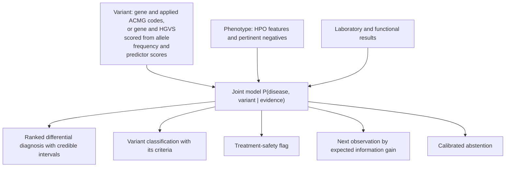

# DISCERN

Diagnostic Inference from Shared-mechanism Coupling of Evidence in Rare Nosology.

[](https://github.com/ahmedanees-m/discern/actions/workflows/ci.yml)
[](https://codecov.io/gh/ahmedanees-m/discern)
[](https://www.python.org)
[](LICENSE)

DISCERN computes a single joint posterior over disease and variant for inherited bleeding and
platelet disorders, and reports four outputs from it: a ranked differential diagnosis, an ACMG
variant classification, a management-aware treatment-safety flag, and the next observation with
the highest expected information gain.

## Overview

Inherited bleeding disorders are frequently misdiagnosed because distinct diseases converge on
the same clinical presentation through shared molecular pathways, and several of the confusable
pairs have opposed management: Glanzmann thrombasthenia against LAD-III, type 2B von Willebrand
disease against platelet-type VWD, Bernard-Soulier syndrome against immune thrombocytopenia,
factor XIII deficiency against a normal coagulation screen. On the expert-panel surface used
here, 974 of 2,239 classified variants (43.5%) are of uncertain significance.

Diagnosis and variant classification are usually built as separate pipelines. They are coupled:
the ACMG criterion PP4 ("phenotype specific for a single disease") requires a disease model,
which a variant-only classifier does not have. DISCERN models both, so the phenotype that ranks
the differential also supplies PP4, and the assay that separates two diseases supplies the
functional evidence that reclassifies the variant.

## Installation

```bash
conda env create -f environment.yml
```

Or, with pip:

```bash
pip install -e ".[dev]"
```

Requires Python 3.11 or later.

## Usage

```python
from core.dx_schemas import Feature, FeatureKind
from jointdx.factorgraph import Evidence
from jointdx.orchestrate import diagnose

evidence = Evidence(
    variant_gene="GP1BA",
    clinical=[Feature("ripa_mixing_platelet_origin", FeatureKind.LAB, True)],
)
recommendation = diagnose(evidence, planned_tx="ddavp")
print(recommendation.posterior.leading)
print(recommendation.explanation)
```

The engine accepts any subset of its inputs: a variant (a gene plus applied ACMG codes, or a
gene and HGVS description scored from allele frequency and predictor scores), clinical features
as HPO terms including explicit negatives, and laboratory or functional results.

`DxRecommendation` carries the ranked diagnosis with credible intervals, the variant
classification and the criteria behind it, any safety flags, the recommended next observation,
a templated explanation, and an audit trail.

A JSON API is available in `api/main.py` (FastAPI, `POST /diagnose`).

## Method

Evidence enters one joint model over disease and variant states:

```
P(D, V | E)  proportional to
    P(E_pheno | D) P(E_geno | V) P(E_func | D, V) P(V | G, D) P(G | D) P(D)
```

Each ACMG criterion is assigned to exactly one factor by `rules/vcep/partition.py`, so no item
of evidence is counted twice. Variant-intrinsic criteria enter the genetic factor, PP4 enters
the disease-to-variant coupling, and functional, segregation and phasing criteria enter their
own factors. Clusters are small enough that the joint is evaluated by exact enumeration.



Variant scoring follows the ClinGen VCEP specifications for ITGA2B/ITGB3, F8, F9, VWF, GP1BA
and RUNX1, including the per-code frequency thresholds, the PVS1 and PS4 strength trees, and
the per-specification REVEL and SpliceAI cut-offs.

Safety flags are adjudicated on a gene-blind posterior. Sequencing one gene does not exclude a
disease of another gene, so a treatment-divergent competitor is not retired by the sequenced
gene alone.

## Discrimination clusters

| Cluster | Confusable diseases | Deciding observation | Management difference |
|---|---|---|---|
| C1 integrin | Glanzmann, LAD-III, RASGRP2, LAD-I | leukocytosis, integrin activation | LAD-III and LAD-I require transplant |
| C2 VWF and GPIb | VWD 2B, platelet-type VWD, VWD 2A | RIPA mixing, plasma against platelet | desmopressin generally contraindicated in 2B |
| C3 macrothrombocytopenia | Bernard-Soulier, MYH9, ITP | blood smear, CD42 flow cytometry | avoids steroids and splenectomy |
| C4 thrombocytopenia with leukaemia risk | RUNX1, ETV6, ANKRD26, ITP | germline panel, pedigree, platelet size | leukaemia surveillance; an affected relative is not a donor |
| C5 VWD 2N against mild haemophilia A | VWD 2N, mild haemophilia A | VWF:FVIII binding assay | inheritance counselling and product choice |
| C6 granule and storage pool | Hermansky-Pudlak, Chediak-Higashi, delta storage pool | electron microscopy, smear, HLH workup | Chediak-Higashi carries HLH risk |
| C7 alpha-granule | gray platelet (NBEAL2), GFI1B, ARC, Quebec | smear, electron microscopy, urokinase assay | Quebec requires antifibrinolytics, not platelets |
| C8 coagulation factor | F8, F9, F11, F13A1, F13B, fibrinogen | factor assays, FXIII activity | recombinant FXIII-A2 treats F13A1 but not F13B |
| C9 mild bleeding and low VWF | type 1 and low VWF, mild platelet defect, normal | repeat VWF, aggregometry, bleeding score | over-diagnosis and under-diagnosis |
| C10 Scott syndrome | Scott syndrome (ANO6), normal workup | phosphatidylserine exposure assay | routine tests are normal |

Every likelihood ratio carries a source PMID and a sample size. A continuous integration check
fails if any entry lacks one.

## Results

Measured on public data. Method and provenance are in `docs/`.

| Evaluation | Dataset | Result |
|---|---|---|
| ACMG combining-rule fidelity | ClinGen Evidence Repository, 2,653 bleeding-panel variants | 93.0% exact, 100% within one bin |
| Evidence partition coverage | ClinGen Evidence Repository, 12,240 variants, 170 genes | every applied criterion routed to exactly one factor |
| Bottom-line reuse inflation | same surface | 33.2% of variants band-determined by non-genetic evidence (95% CI 32.4 to 34.1) |
| Variant classification, time-split | expert-panel surface, missense | AUROC 0.939 (95% CI 0.906 to 0.967) |
| Calibration, out-of-fold isotonic | same | ECE 0.017 |
| Frequency threshold agreement | gnomAD frequencies cited in the expert records, 629 variants | 97.8% |
| Null-variant recall | CDC CHAMP and CHBMP, 2,130 null variants | 91.2% (F8 97.7%, F9 65.8%) |
| Intrinsic-evidence ceiling | 425 expert-classified missense variants | none reach a pathogenic band on sequence evidence alone |
| Diagnosis, curated cases | 42 published cases across 10 clusters | Top-1 100%, against a phenotype-blind gene baseline of 93% |
| Safety interlock | 5 treatment-divergence scenarios | 100% sensitivity and specificity |

Two comparisons against LIRICAL 2.4.1 on the 23 cases carrying HPO terms support different
claims and should not be combined. Restricted to the 13 findings HPO can express, with the gene
withheld from both, DISCERN reaches 74% against LIRICAL's 57% (McNemar p = 0.29), so an
advantage in reasoning on identical evidence is not established. Allowed the full 48 findings,
DISCERN reaches 91% (p = 0.02), which is significant but is a claim about what the model can
represent rather than about inference.

The 100% figure on the curated cases is in-sample. Those cases exposed a defect in the joint
model, which was then corrected, so the figure is not a head-to-head result and is not reported
as one. Before the correction the same benchmark scored 81%.

## Reproducing the results

Each harness writes the JSON file that the figures, tables and tests read.

```bash
python -m eval.erepo_reconstruction        # ACMG fidelity and partition coverage
python -m eval.erepo_genomewide            # genome-wide partition
python -m eval.champ_chbmp_benchmark       # CDC catalog recall
python -m eval.curated_case_benchmark      # curated-case diagnosis
python -m bench.phase_r_variant            # variant arm, out-of-fold calibration
python -m figures.make_figures             # figures 1-6 and S1-S5
python -m figures.make_tables              # tables 1-3 and S1-S9
```

Third-party databases are not redistributed. `data/manifest.json` records each source with its
URL, version and checksum. `docs/DISCERN_Reproducibility_Checklist.md` gives the order and the
expected outputs.

## Repository layout

```
core/           shared schemas and the disease-variant data model
rules/          ACMG point engine, variant scoring, VCEP specifications, criterion partition
adapters/       evidence adapters: gnomAD, ClinVar, in-silico, splice, PVS1, MAVE, phenotype
evidence/       genetic, phenotype likelihood ratios including negatives, laboratory, functional
diseases/       disease ontology and the C1-C10 discrimination clusters
jointdx/        joint model: factor graph, inference, uncertainty, abstention, explanation
safety/         treatment-safety interlock
engine/         evidence-gap analysis, value of information, action mapping, case policy
nextobs/        next-observation ranking, partial input, what-if
equity/         ancestry reliability, evidence routing, reporting
learn/          outcome store and auditable prior updates
eval/           validation harnesses
bench/          positioning benchmarks and the pre-submission re-analysis
figures/        figure and table generation
api/  llm/      FastAPI endpoint and model gateway
deploy/ docker/ deployment helpers and images
tests/          test suite and continuous integration guards
docs/           validation results, claims map, reproducibility checklist, pre-registration
```

## Testing

```bash
make test        # ruff and pytest
make ci          # lint and tests against tracked files only, as CI sees them
```

The suite has 245 tests. Several are regression guards rather than unit tests: they fail if a
reported value drifts from its harness output, if a likelihood ratio loses its source, if a
retired claim reappears in the documentation, or if an ACMG criterion changes factor.

## Status and scope

The engine and its open-data evaluation are complete. The disease-variant coupling that
motivates the architecture is implemented and unit-tested, but it is not validated on real
paired phenotype-genotype data, because public corpora do not contain enough such cases. Its
evaluation is pre-registered with an explicit falsification condition and is not claimed until
that endpoint is reported.

Two claims were retired during pre-submission re-analysis and are made nowhere in this
repository. DISCERN is not the only tool emitting a calibrated probability: under the same folds
and isotonic protocol, REVEL reaches ECE 0.043 and AlphaMissense 0.029 against DISCERN's 0.017,
with overlapping intervals. The AUROC difference against REVEL is not significant (DeLong
p = 0.29). A monotone risk-coverage claim was withdrawn because the diagnosis arm sits at
ceiling at full coverage, leaving no headroom at this sample size.

No patient-level data appears in any public artifact. The engine recommends; it does not
diagnose or treat without human sign-off.

`docs/DISCERN_PhaseR_Results_v1.md` records the pre-submission re-analysis in full, including
the results that removed claims.

## Citation

Cite using [CITATION.cff](CITATION.cff).

## License

MIT, see [LICENSE](LICENSE). Reference datasets retain their upstream licences.

Author: Anees Ahmed Mahaboob Ali ([@ahmedanees-m](https://github.com/ahmedanees-m)).
